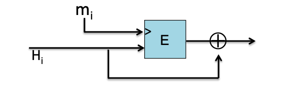
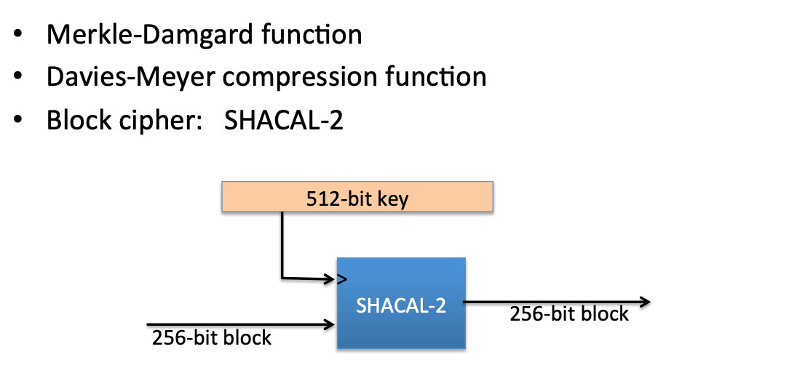

# 16 Collision Resistance 2: constructions

## The Merkle-Damgård iterated construction

给定压缩函数 $h: T \times X \longrightarrow T$

Merkle-Damgård 构造定义如下：

$H_0 = IV$

$H_i = h(H_{i-1}, M_i)$ 其中 $i = 1,\dots,\ell$

$H(M) = H_\ell$

其中 $PB$ 是填充函数，一定要包含消息长度信息，形如 $1 || 0^k || Msg Length$，$M_i$ 是消息的第 $i$ 个块。

## MD collision resistance

### 定理

如果 $h$ 具有碰撞抗性，那么 $H$ 也具有碰撞抗性。

### 证明

通过归约：碰撞在 $H$ 上 $\Rightarrow$ 碰撞在 $h$ 上

假设 $H(M) = H(M')$，我们来构造 $h$ 的碰撞。

- 设 $M$ 被填充并分块为 $M_1, M_2, ..., M_k$
- 设 $M'$ 被填充并分块为 $M'_1, M'_2, ..., M'_{k'}$
- 定义中间链式变量：
  - $H_i = h(H_{i-1}, M_i)$
  - $H'_i = h(H'_{i-1}, M'_i)$

如果在某个位置 $i$ 有：

- $H_{i-1} = H'_{i-1}$ 但 $M_i \neq M'_i$ 或者 $H_{i-1} \neq H'_{i-1}$
- 则找到了 $h$ 的碰撞，因为：
  $h(H_{i-1}, M_i) = h(H'_{i-1}, M'_i)$ 但输入不同

而 $H(M) = H(M')$， 因此要么 $H_{i-1} = H'_{i-1}$ 且 $M_{i-1} = M'_{i-1}$，要么已经找到了 $h$ 的碰撞。 对于前者可以一直往前递归，直到找到碰撞。如果找不到则说明 $M = M'$，这与假设矛盾。

因此，如果能在 $H$ 上找到碰撞，必然能在 $h$ 上找到碰撞。
这与 $h$ 的碰撞抗性假设矛盾，所以 $H$ 必须也是碰撞抗性的。

## Davies-Meyer 压缩函数

假设 $E: K \times \{0,1\}^n \rightarrow \{0,1\}^n$ 是一个块加密函数，$K$ 是密钥。

$h(H, m) = E(m, H) \oplus H$

其中：

- $H$ 是链式变量（上一个哈希值）
- $m$ 是消息块
- $\oplus$ 表示异或操作

## 简化版压缩函数安全性分析

$h(H, m) = E(m, H)$ （注意：移除了 ⊕H）

1. 随机选择 $(H,m,m')$
2. 设定 $H'=D(m', E(m,H))$
3. 验证碰撞 $h(H',m') = E(m',H') = E(m',D(m',E(m,H))) = E(m,H)$

## 其他的构造

Miyaguchi-Preneel 安全变体

- $h(H, m) = E(m, H) \oplus H \oplus m$
- $h(H, m) = E(H \oplus m, m) \oplus m$

一共有12种类似的安全变体

下面是另一种不安全的变体
- $h(H, m) = E(m, H) \oplus m$

## SHA-256 的 Davies-Meyer 构造

## 可证明安全的压缩函数

### 参数设置
- 选择随机 2000 位的素数 $p$
- 随机选择 $1 \leq u, v \leq p$

### 函数定义
对于 $m,h \in \{0,...,p-1\}$，定义：
$h(H,m) = u^H \cdot v^m \pmod{p}$

找到碰撞的难度和解决离散对数问题是一样的。

缺点：运行效率低。